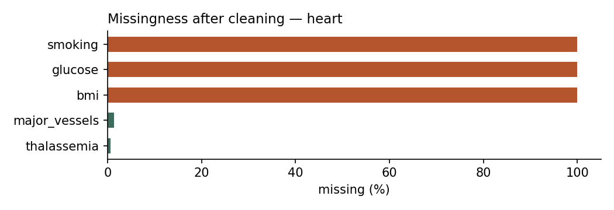
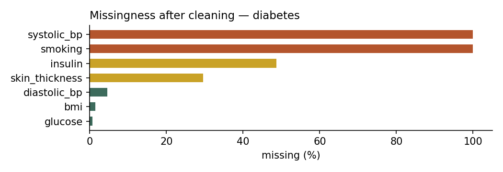
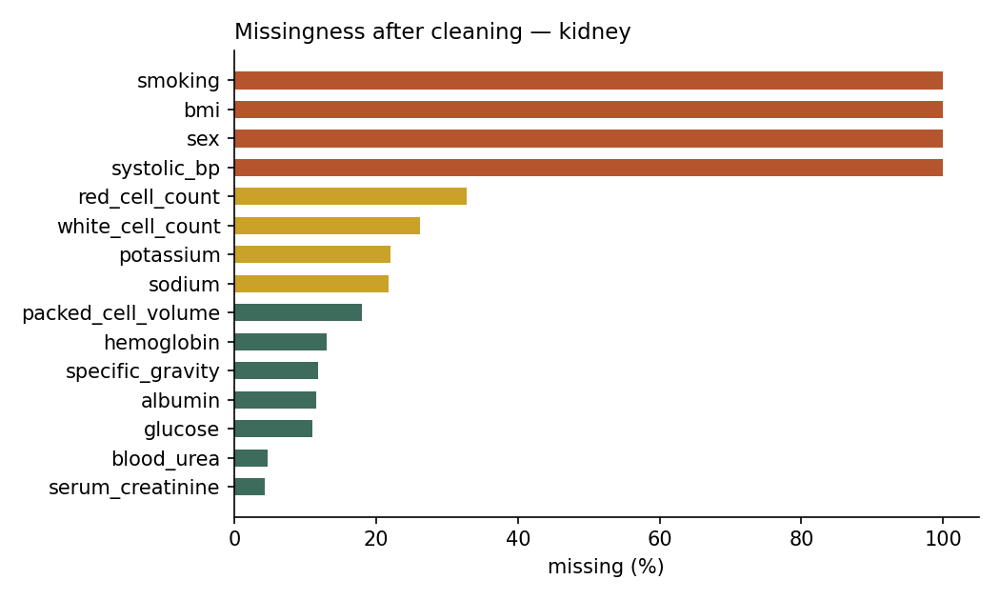
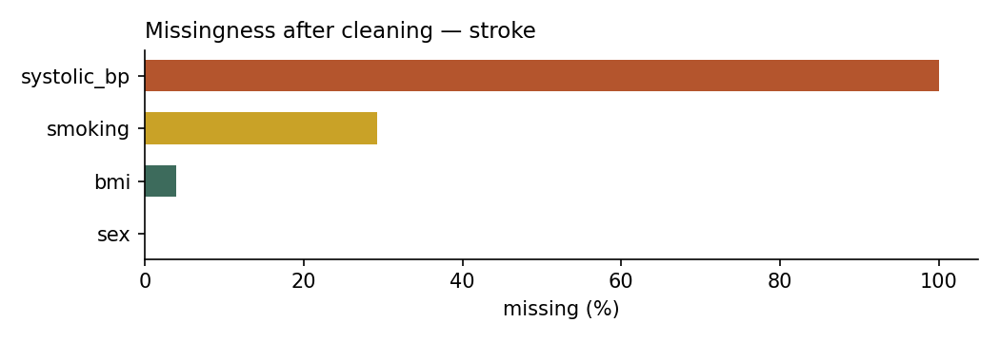
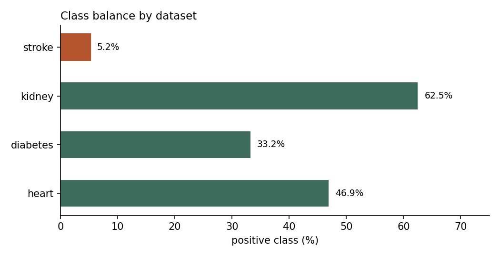

# Dataset Audit

> Generated by `src/data/audit.py` from `artifacts/cleaning_report.json`. Do not edit by hand — re-run the script instead.

This document records what is actually in the four source datasets, what is broken in them, and what that implies for a system that claims to score one patient against four disease models.

## 1. Headline finding

**Of the 6 core clinical fields the patient form collects, only 1 — `age` — is measured directly and comparably in all four source datasets.**

Every other core field is missing, unmeasured, or recorded as a different quantity in at least one dataset. This is the empirical basis for the design decision described in Section 5: the platform trains a *full-feature* and a *core-only* model per disease and reports the accuracy cost of the difference, rather than pretending one patient vector can honestly drive four heterogeneous models.

## 2. Core-field coverage matrix

| Core field | Heart Disease | Diabetes | Chronic Kidney Disease | Stroke |
|---|---|---|---|---|
| `age` | **direct** | **direct** | **direct** | **direct** |
| `sex` | **direct** | **constant** female-only cohort, zero variance | **ABSENT** not collected | **direct** |
| `systolic_bp` | **direct** | **proxy** diastolic pressure recorded instead | **proxy** diastolic pressure recorded instead | **ABSENT** no BP reading, binary hypertension flag only |
| `bmi` | **ABSENT** not collected | **direct** | **ABSENT** not collected | **direct** |
| `glucose` | **proxy** binary fbs flag (>120 mg/dL) only, no value | **direct** | **direct** | **direct** |
| `smoking` | **ABSENT** not collected | **ABSENT** not collected | **ABSENT** not collected | **direct** |

Legend — **direct**: a comparable measurement of the same quantity. **proxy**: a related but non-equivalent measurement. **constant**: present but with no variance. **ABSENT**: never collected.

## 3. Dataset profiles

### 3.1 Heart Disease

- **Source:** UCI Cleveland Heart Disease
- **Rows:** 303
- **Raw columns:** 14 → **16 features after cleaning** (13 usable, 3 structurally empty)
- **Positive class:** 142 of 303 (46.86%), imbalance ratio 1.1 : 1
- **Structurally empty in this source:** `glucose`, `bmi`, `smoking`

**Cleaning actions applied**

- glucose left NaN: source records only binary fbs (>120 mg/dL)
- bmi left NaN: not collected by UCI Heart
- smoking left NaN: not collected by UCI Heart
- ca: 4 '?' markers decoded as missing
- thal: 2 '?' markers decoded as missing
- target binarised from num (0-4) as num > 0

**Highest missingness after cleaning**

| Feature | Missing |
|---|---|
| `glucose` | 100.0% |
| `bmi` | 100.0% |
| `smoking` | 100.0% |
| `major_vessels` | 1.3% |
| `thalassemia` | 0.7% |

### 3.2 Diabetes

- **Source:** Pima Indians Diabetes (NIDDK)
- **Rows:** 768
- **Raw columns:** 9 → **11 features after cleaning** (9 usable, 2 structurally empty)
- **Positive class:** 255 of 768 (33.20%), imbalance ratio 2.0 : 1
- **Structurally empty in this source:** `systolic_bp`, `smoking`

**Cleaning actions applied**

- sex set to 'female' for all rows: Pima cohort is female-only
- systolic_bp left NaN: source records DIASTOLIC pressure only
- smoking left NaN: not collected by Pima
- Glucose: 5 physiologically impossible zeros (0.7%) decoded as missing
- BloodPressure: 35 physiologically impossible zeros (4.6%) decoded as missing
- SkinThickness: 227 physiologically impossible zeros (29.6%) decoded as missing
- Insulin: 374 physiologically impossible zeros (48.7%) decoded as missing
- BMI: 11 physiologically impossible zeros (1.4%) decoded as missing

**Highest missingness after cleaning**

| Feature | Missing |
|---|---|
| `systolic_bp` | 100.0% |
| `smoking` | 100.0% |
| `insulin` | 48.7% |
| `skin_thickness` | 29.6% |
| `diastolic_bp` | 4.6% |
| `bmi` | 1.4% |
| `glucose` | 0.7% |

### 3.3 Chronic Kidney Disease

- **Source:** UCI Chronic Kidney Disease
- **Rows:** 400
- **Raw columns:** 25 → **28 features after cleaning** (24 usable, 4 structurally empty)
- **Positive class:** 250 of 400 (62.50%), imbalance ratio 0.6 : 1
- **Structurally empty in this source:** `sex`, `bmi`, `smoking`, `systolic_bp`

**Cleaning actions applied**

- sex left NaN: not collected by UCI CKD
- bmi left NaN: not collected by UCI CKD
- smoking left NaN: not collected by UCI CKD
- systolic_bp left NaN: source records DIASTOLIC pressure only
- coerced string-typed numerics to float (stray tabs/spaces): sc, bu, hemo, sod, pot, pcv, wc, rc
- classification: 12 labels carried a trailing tab ('ckd\t'); stripped before mapping

**Highest missingness after cleaning**

| Feature | Missing |
|---|---|
| `sex` | 100.0% |
| `bmi` | 100.0% |
| `smoking` | 100.0% |
| `systolic_bp` | 100.0% |
| `red_cell_count` | 32.8% |
| `white_cell_count` | 26.2% |
| `potassium` | 22.0% |
| `sodium` | 21.8% |

### 3.4 Stroke

- **Source:** Kaggle Healthcare Stroke Prediction
- **Rows:** 5,110
- **Raw columns:** 12 → **11 features after cleaning** (10 usable, 1 structurally empty)
- **Positive class:** 267 of 5,110 (5.23%), imbalance ratio 18.1 : 1
- **Structurally empty in this source:** `systolic_bp`

**Cleaning actions applied**

- gender: 1 row(s) outside male/female decoded as missing (the real file contains one 'Other')
- systolic_bp left NaN: source has no BP reading, only a binary hypertension flag
- bmi: 201 missing values left as NaN for in-pipeline imputation
- smoking: 1494 rows (29.2%) coded 'Unknown' in source, decoded as missing rather than as 'never'
- class balance: 5.23% positive -- accuracy is not a usable metric here

**Highest missingness after cleaning**

| Feature | Missing |
|---|---|
| `systolic_bp` | 100.0% |
| `smoking` | 29.2% |
| `bmi` | 3.9% |
| `sex` | 0.0% |

## 4. Known limitations and their consequences

| # | Limitation | Consequence for HealthGuard AI | How we respond |
|---|---|---|---|
| 1 | Populations do not match. The four datasets describe four unrelated cohorts recruited in different countries and decades. | Risk scores are not commensurable; they cannot be averaged into a single 'overall health score'. | The naive averaged score is removed. Section 5 defines a triage tier instead, explicitly labelled as a heuristic, not a probability. |
| 2 | Pima contains female patients only. | Any diabetes prediction for a male patient is an extrapolation outside the training population. | A high-severity model-scope warning fires in the UI whenever `sex = male` is submitted for the diabetes model. |
| 3 | Pima and CKD record diastolic blood pressure; UCI Heart records systolic; Kaggle Stroke records neither. | A single 'blood pressure' input cannot feed all four models. | Diastolic is kept as a separate disease-specific feature. `systolic_bp` is marked absent where it was never measured. |
| 4 | Stroke is 5% positive. | A model predicting 'no stroke' for everyone scores ~95% accuracy and is clinically useless. | Stroke is judged by PR-AUC and recall, never accuracy. Class weighting is applied inside the pipeline; SMOTE is deliberately avoided. |
| 5 | Pima encodes missing values as physiologically impossible zeros. | Training on raw Pima teaches the model that a glucose of 0 is meaningful. | Zeros in the five affected columns are decoded to NaN before any modelling, and imputed inside the CV pipeline. |
| 6 | Kaggle Stroke codes 29% of smoking status as 'Unknown'. | Treating 'Unknown' as 'never' would fabricate a third of the exposure data. | 'Unknown' is decoded as missing, not as 'never'. |
| 7 | Sample sizes are small (303 and 400 rows for heart and kidney). | Single train/test splits produce accuracy estimates that swing several points on the luck of the split. | Repeated stratified k-fold (5 folds x 5 repeats); every metric is reported with its standard deviation. |

## 5. Design consequences

1. **Two model variants per disease.** Each disease is trained on its full feature set and again on core fields alone. The gap between them quantifies what the user loses by leaving optional fields blank, and is reported in `docs/report_material.md`.
2. **No averaged health score.** Four probabilities from four populations do not average into anything defensible. The platform reports each disease separately plus a triage tier derived from the highest calibrated single-disease risk.
3. **Scope warnings are a UI feature, not a footnote.** Dataset limitations that affect a specific patient are surfaced at prediction time (`schema/core_schema.yaml` → `scope_warnings`).
4. **Accuracy is reported honestly.** All preprocessing is fitted inside the cross-validation pipeline. Figures are lower than the 90–95% commonly reported on these datasets, and that gap is itself a finding.

